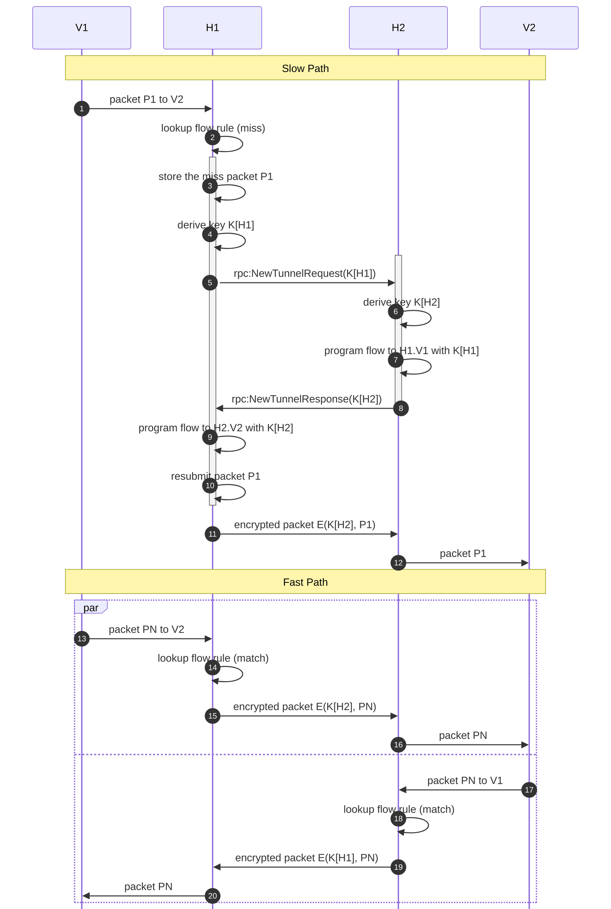
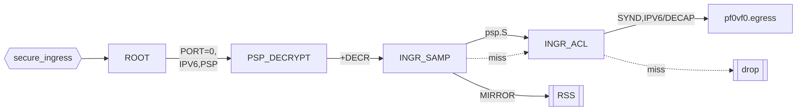
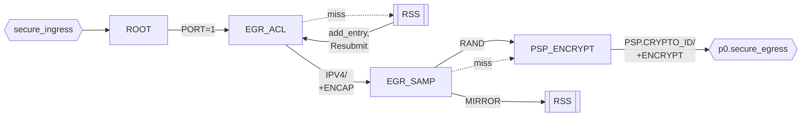

<!---
/*
 * Copyright (c) 2021-2022 NVIDIA CORPORATION & AFFILIATES, ALL RIGHTS RESERVED.
 *
 * This software product is a proprietary product of NVIDIA CORPORATION &
 * AFFILIATES (the "Company") and all right, title, and interest in and to the
 * software product, including all associated intellectual property rights, are
 * and shall remain exclusively with the Company.
 *
 * This software product is governed by the End User License Agreement
 * provided with the software product.
 *
 */
--->
# User-Space PSP Application README

## Sequence of Events

In this sequence, two hosts, H1 and H2, are running tenant VM workloads V1 and V2, respectively, as well as the PSP application.

The sequence begins with the workload V1 on host H1 attempting to send a packet to workload V2 on host H2.

## DOCA Flow Pipes

WIP.

### Net-to-Host (N2H) Datapath Flow

### N2H Exception Flow

### Host-to-Net (H2N) Datapath Flow

### H2N Exception packets (ARP/DHCP):

### Pipe Entry Scale Factors

For 'N' peers.

|Pipe|Entries|Dynamic|Notes|
|----|----|----|----|
|ROOT|3|No|Classification of Flows
|PSP_DECRYPT|1|No|One master key supports all N peers
|PSP_ENCRYPT|N|No|Maps meta->crypto_id; never changes
|INGR_ACL|N|Yes|
|EGR_ACL|N|Yes|Maps each dst IP to meta
